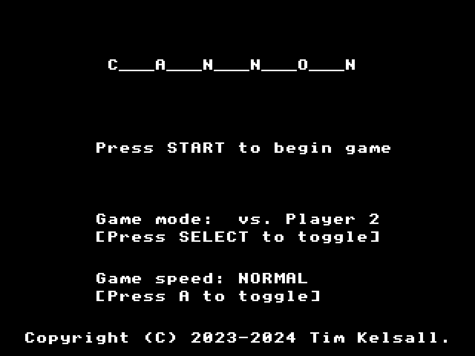
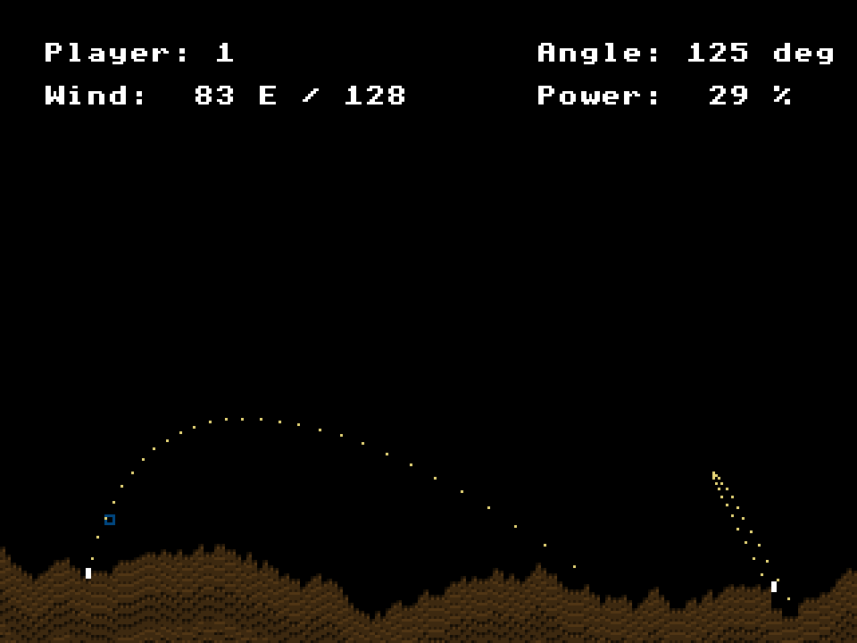

= Artillery.c16 =

A game inspired by Scorched Earth and clones. Cannons take it in turn to fire
shells, adjusting angle and launch power, and adjusting for wind speed.

== Gameplay ==

- Select:
..* Play against another player (uses only Controller 1, as it is turn based)
..* Play against a bot ("CPU")
- Select:
..* regular, slowed-down game speed;
..* or fast, real-time game speed.
- Aim with Up/Down buttons; fire with A button. Reset game with Select.

== Technical details ==

- Uses a simple one-pass random terrain generation scheme.
- Bot player uses feedback from previous shot to adjust power up/down, scaled
slightly to distance.
- Terrain is column based, as is the destruction.
- Trails are recorded by storing all shell positions of last turn in a trail
list which gets rendered.
